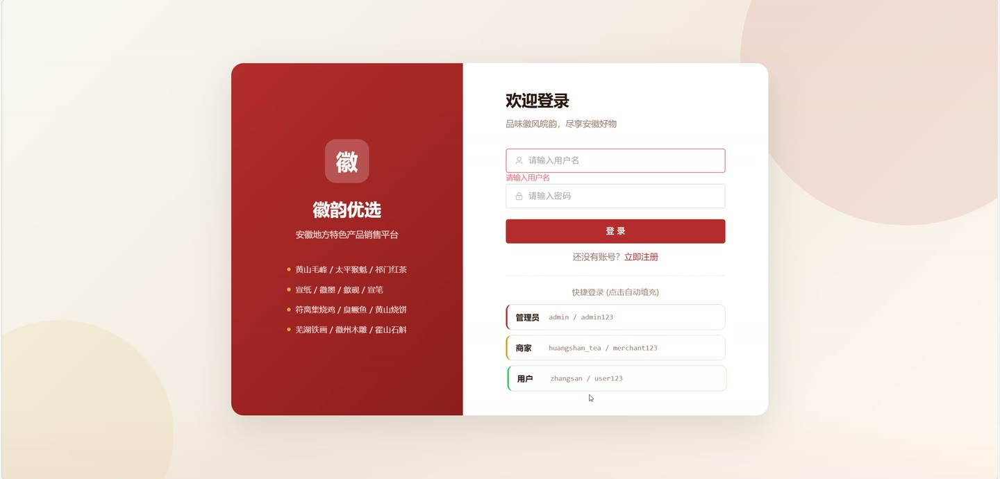
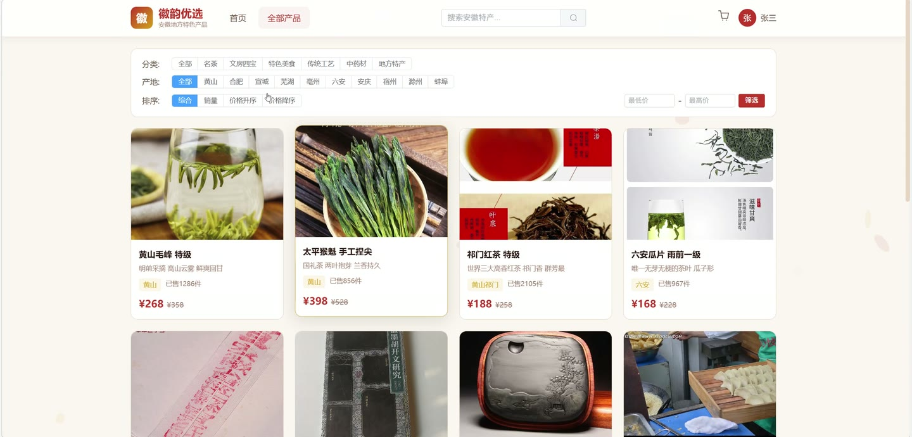
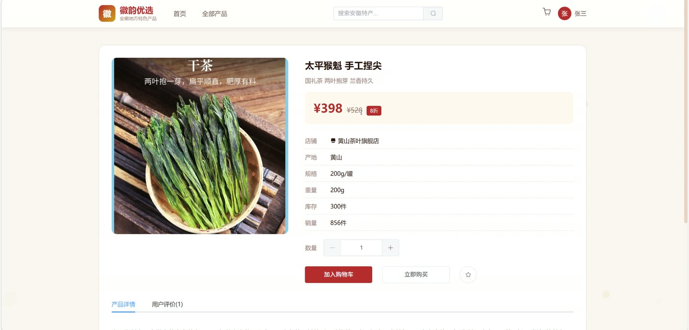
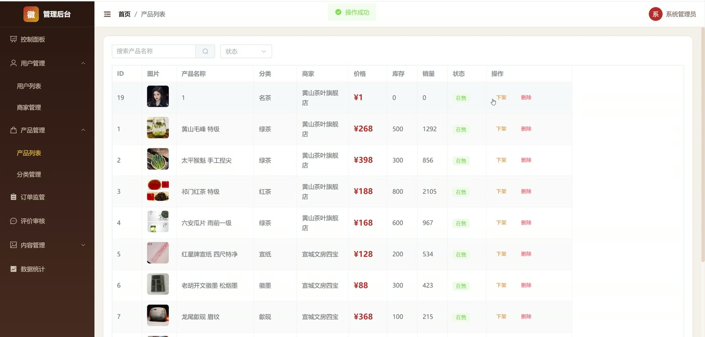
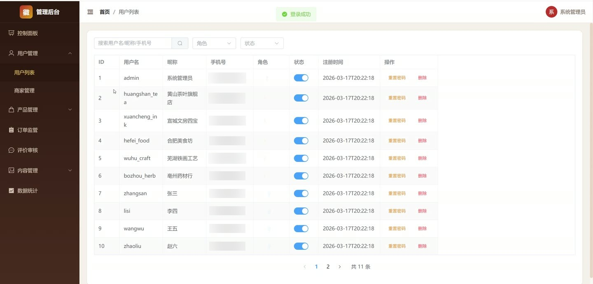
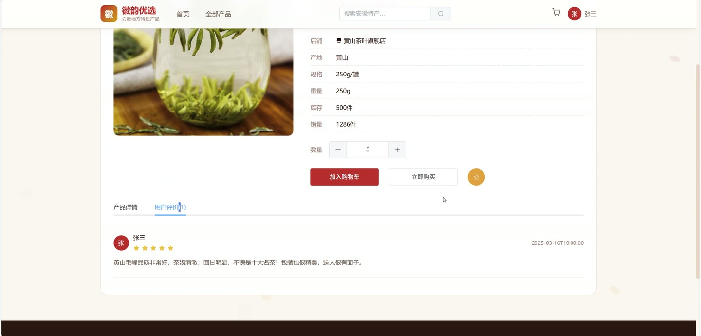

# (附文档)Springboot3+Vue3 安徽地方特色产品销售网站

**技术栈**：Springboot3、Vue3

### 系统简介

本系统是一个基于 Spring Boot 3 + Vue 3 前后端分离架构的安徽地方特色产品销售网站。平台包含三种角色：普通用户（浏览、购买、评价）、商家（店铺管理、商品管理、订单处理）、管理员（平台运营管理、数据统计）。系统实现了商品浏览、购物车、订单流转、商家入驻审核、评价管理、优惠券等完整电商功能。
 
### 核心功能
 
### 普通用户端

 
- 用户注册与登录：支持用户名密码注册/登录，商家注册需填写店铺信息并提交审核 
- 首页数据聚合：获取轮播图、热销产品、新品推荐、顶级分类等首页数据 
- 商品浏览与搜索：按关键词、分类、地区、价格区间筛选商品，支持按销量/价格/时间排序 
- 商品详情查看：查看商品主图、价格、库存、商家信息（店铺名）等详情 
- 购物车管理：添加商品到购物车、修改数量、切换选中状态、全选/取消全选、删除商品 
- 收货地址管理：添加/修改/删除地址，设置默认地址，下单时选择收货地址 
- 订单创建与支付：从购物车选中商品按商家自动拆单，填写备注后创建订单，支持支付/取消/确认收货 
- 退款申请：对已支付订单申请退款，填写退款原因 
- 商品收藏：添加/取消收藏商品，查看我的收藏列表（分页） 
- 评价功能：对已完成订单提交评价（含评分、内容），可修改/删除自己的评价 
- 个人信息管理：修改昵称、手机号等个人信息，修改登录密码（需验证旧密码）
 
### 商家端

 
- 商家入驻申请：提交店铺名称、联系人、地区、描述等信息，等待管理员审核 
- 商家信息管理：查看/修改店铺信息（店铺Logo、描述等，不可修改审核状态） 
- 商品管理：发布商品（自动设为待审核）、编辑商品信息、上下架商品、删除商品 
- 订单处理：查看本店订单列表（按状态/订单号筛选），执行发货（填写物流公司/单号）、审核退款（同意/拒绝并填写拒绝原因） 
- 评价管理：查看本店商品收到的评价列表，对评价进行回复 
- 数据统计：查看本店订单统计数据（含月度订单趋势、收入等）
 
### 管理员端

 
- 仪表盘概览：查看平台用户数、商家数、商品统计、订单统计等汇总数据 
- 图表统计：查看月度订单趋势、月度收入、分类产品分布、地区销售排行 
- 用户管理：分页查询用户列表（可按关键词/角色/状态筛选），重置用户密码为 123456，启用/禁用用户，删除用户 
- 商家管理：分页查询商家列表（按关键词/审核状态筛选），审核商家入驻（通过/拒绝），删除商家 
- 商品管理：分页查询所有商品（按关键词/状态/分类筛选），修改商品状态（上架/下架/审核），删除商品 
- 分类管理：添加/修改/删除商品分类（支持树形结构） 
- 订单管理：分页查询所有订单（按状态/订单号/关键词筛选），查看订单详情 
- 评价管理：分页查询所有评价（按状态/关键词筛选），审核评价（通过/屏蔽），删除评价 
- 轮播图管理：添加/修改/删除轮播图（设置标题、图片、链接、排序、启用状态）
 
### 技术栈

 后端框架Spring Boot 3 ORMMyBatis-Plus 权限控制Session 登录校验（角色：普通用户/商家/管理员） 前端框架Vue 3 状态管理Vuex / Pinia 构建工具Vite 数据库MySQL 文件上传MultipartFile 本地存储
 
### 交付内容

 
- 后端完整源码 
- 前端完整源码 
- 数据库初始化脚本 
- 万字文档

## 界面展示

---

## 获取完整源码 + 万字文档

本仓库为项目介绍页。**完整前后端源码、数据库初始化脚本、万字项目文档**，请加微信 `kangkangcode`，或访问 [codekk.top](http://codekk.top) 获取。

可作课程设计 / 毕业设计参考，支持远程部署调试。